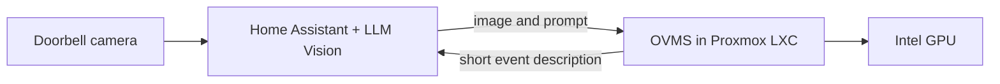

# OpenVINO Model Server for Proxmox

### Local vision AI for Home Assistant, served from an Intel GPU—inside a native Proxmox LXC.

This personal helper installs [OpenVINO Model Server (OVMS)](https://github.com/openvinotoolkit/model_server) and a ready-to-use vision-language model without Docker. The goal is straightforward: let Home Assistant send a camera image to a local model and get a short description back, without relying on a cloud vision API.

> This is an independent personal project, not an official Proxmox or Proxmox Community Scripts helper. It is hardware-specific and should be reviewed before running as root.

## What it sets up

- An unprivileged Ubuntu 24.04 LXC with OVMS installed as a native systemd service.
- Intel GPU render-device mapping from the Proxmox host.
- `OpenVINO/Qwen3-VL-4B-Instruct-int4-ov`, exposed as `qwen3-vl-4b` over an OpenAI-compatible API.
- A text-and-image GPU health check. If GPU inference fails, setup reports the failure; it does not silently switch to CPU.
- A Proxmox-style interactive setup, tty1 root-console autologin, and an in-container `update` command.

The first boot downloads roughly 3.1 GB of model files. The default LXC sizing is 8 CPU cores, 16 GiB RAM, and a 48 GiB root disk; the installer offers an Advanced Setup for choosing resources, storage, bridge, and container ID.

## How it fits together



## Quick start

Run on the Proxmox VE host as root. Inspect the script before executing it:

```bash
curl -fL https://raw.githubusercontent.com/exelaguilar/proxmox-ovms-helper/main/ovms-lxc-helper.sh -o /root/ovms-lxc-helper.sh
less /root/ovms-lxc-helper.sh
bash /root/ovms-lxc-helper.sh
```

The installer checks the host GPU, render node, Proxmox version, storage, and network configuration. It displays a plan for confirmation before creating a new container. If setup fails after container creation, it leaves that container in place for troubleshooting rather than deleting it.

## Home Assistant

Use LLM Vision's **Custom OpenAI** provider and select it in the relevant action or blueprint. The endpoint is `http://<CT-IP>:8000/v1/chat/completions` for integrations that request a full endpoint, or `http://<CT-IP>:8000/v1` when the integration requests a base URL. The model name is `qwen3-vl-4b`; `openai` can be used as a dummy API key when required by the client.

OVMS does not enable authentication or TLS for this endpoint by default. Keep it on a trusted LAN or firewall port 8000 to Home Assistant. More setup details are in [Installation and operation](INSTALL.md).

## Tested GPU workaround

On one Arrow Lake-P / Intel `8086:7d51` Proxmox system, the `VLM_CB` pipeline failed with `CL_OUT_OF_RESOURCES`, including with a single sequence. Switching the pipeline to `VLM` while keeping `--target_device GPU` enabled text and image inference, including a Home Assistant doorbell-image request. This is a tested workaround for that setup, not a confirmed root-cause fix for every Intel GPU or driver combination.

The tradeoff is that `VLM` does not use continuous batching, so it is less suited to high-concurrency serving. For a single Home Assistant camera workflow, the simpler pipeline has worked well. See [GPU troubleshooting and findings](GPU-TROUBLESHOOTING.md) for reproduction details, limitations, and a draft upstream report.

## Project notes

- [Installation and operation](INSTALL.md)
- [GPU troubleshooting and findings](GPU-TROUBLESHOOTING.md)
- [Helper script](ovms-lxc-helper.sh)
